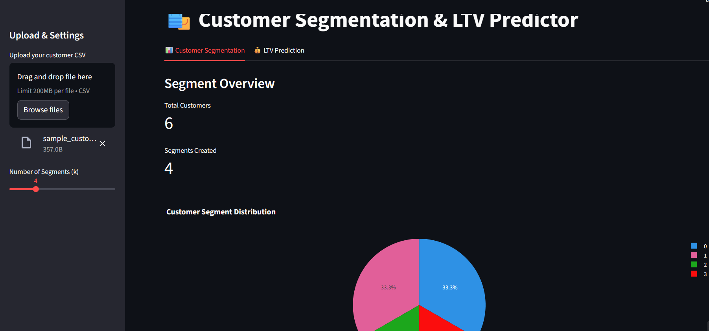
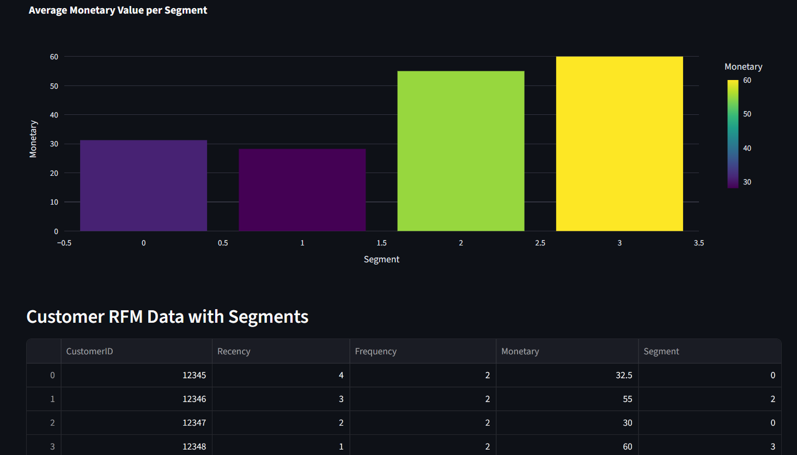
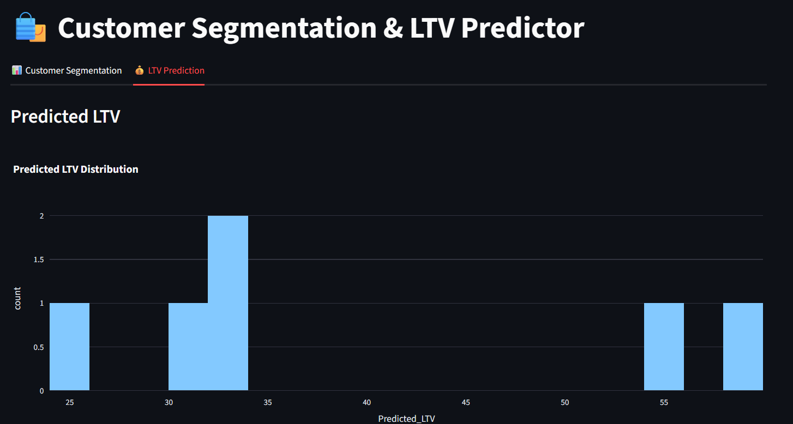
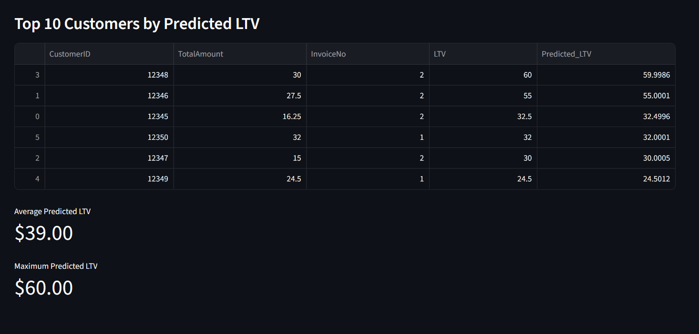

# AI-Powered Customer Segmentation & Lifetime Value Prediction

## 📌 Overview
This project is an end-to-end machine learning application for **customer analytics**.  
It segments customers using **RFM-based K-Means clustering** and predicts **Customer Lifetime Value (LTV)** using regression models.  
The results are displayed through an **interactive Streamlit dashboard** for marketing teams to take actionable decisions.

---

## 🚀 Features
- Upload your transactional customer data (CSV format)
- Perform **RFM analysis** automatically
- Segment customers with **K-Means clustering**
- Predict **Customer Lifetime Value** using regression models (XGBoost / Random Forest)
- Interactive visualizations for better insights

---

## 📸 Demo Screenshots

## 📸 Demo Screenshots

  
  
  

---

## 🗂 Data Requirements
Your CSV should contain at least:
- **CustomerID**
- **InvoiceDate**
- **InvoiceNo**
- **Quantity**
- **UnitPrice**

---
